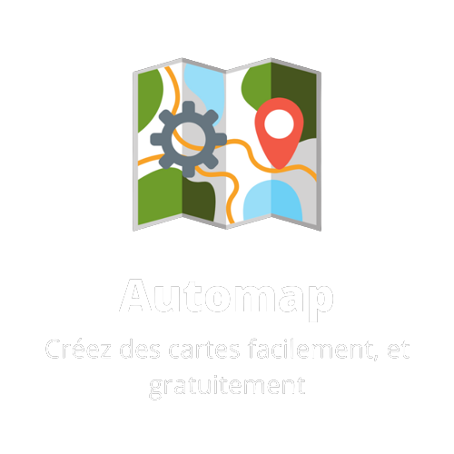

 

 

Générez gratuitement des cartes Open Street Map avec ce petit logiciel gratuit. Automap vous permet de créer des cartes simplement à l'aide de quelques clics.

<h2 align="center">Aperçu</h2>

<h2 align="center">Remerciements</h2>
<ul align="center">
    <li>Totorejtt (testeur +)</li>
    <li>Polo228 (testeur)</li>
</ul>

